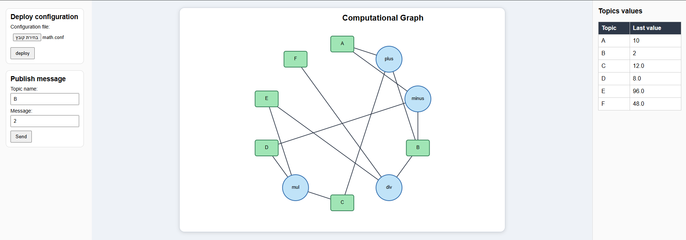

# Advanced Programming Project

## Application Screenshot



## Author

- Eviatar Cohen

---

# Overview

This project implements a computational graph based on the Publish/Subscribe (Pub/Sub) architecture.

The application allows users to deploy a computational graph from a configuration file, publish values to input topics through a web interface, and automatically propagate computations across the graph.

The project also includes a lightweight HTTP server implemented entirely in Java without external frameworks.

---

# Features

- Publish / Subscribe messaging system
- Dynamic computational graph
- Configuration-based graph deployment
- Lightweight HTTP server
- HTML web interface
- Automatic graph visualization
- Parallel execution using `ParallelAgent`
- Extensible computational agents

---

---

# Design Decisions

The project was designed in a modular way in order to separate the different responsibilities of the system.

### HTTP Server

The server package implements a lightweight multithreaded HTTP server that receives client requests and dispatches them to the appropriate servlet according to the request path and HTTP method.

### Publish / Subscribe System

The graph package implements a Publish/Subscribe architecture. Topics are responsible for distributing messages to subscribed agents, while each agent performs its own computation independently.

### Configuration Loader

The computational graph is not hard-coded. Instead, it is created dynamically by loading a configuration file. This allows different computational graphs to be deployed without changing the source code.

### Graph Visualization

The graph is automatically converted into an HTML representation using `HtmlGraphWriter`, allowing the deployed graph to be visualized directly from the browser.

### Extensibility

The project was designed to be easily extensible. New computational agents can be added simply by implementing a new agent class and referencing it from a configuration file, without modifying the server or the user interface.

---


# Project Structure

```text
src
│
├── configs
│   ├── BinOpAgent.java
│   ├── Config.java
│   ├── DivAgent.java
│   ├── GenericConfig.java
│   ├── IncAgent.java
│   ├── MinusAgent.java
│   ├── MulAgent.java
│   └── PlusAgent.java
│
├── graph
│   ├── Agent.java
│   ├── Graph.java
│   ├── Message.java
│   ├── Node.java
│   ├── ParallelAgent.java
│   ├── Topic.java
│   └── TopicManagerSingleton.java
│
├── server
│   ├── HTTPServer.java
│   ├── MyHTTPServer.java
│   └── RequestParser.java
│
├── servlets
│   ├── Servlet.java
│   ├── HtmlLoader.java
│   ├── ConfLoader.java
│   ├── TopicDisplayer.java
│   └── HttpUtil.java
│
├── views
│   └── HtmlGraphWriter.java
│
└── Main.java
```

---

# Configuration Files

Configuration files are located in:

```text
files_config/
```

The demo configuration used in this project is:

```text
math.conf
```

It computes the following expressions:

```text
C = A + B
D = A - B
E = C × D
F = E ÷ B
```

---

# HTML Files

The web interface is located in:

```text
files_html/
```

Files:

- index.html
- form.html
- graph.html
- temp.html

---

# How to Run

1. Clone the repository:

```bash
git clone https://github.com/eviatar988/AdvancedProgrammingProject.git
```

2. Open the project in IntelliJ IDEA.

3. Build the project.

4. Run:

```text
Main.java
```

5. Open:

```text
http://localhost:8080/app/index.html
```

6. Upload:

```text
math.conf
```

7. Publish values.

---

# Example

Input:

```text
A = 10
B = 2
```

Output:

```text
C = 12
D = 8
E = 96
F = 48
```

---

# Implemented Agents

- PlusAgent
- IncAgent
- MinusAgent
- MulAgent
- DivAgent

The architecture allows additional computational agents to be added without modifying the server implementation.

---

# Technologies

- Java
- HTML
- CSS
- HTTP
- TCP Sockets
- Java Threads
- IntelliJ IDEA
- Git
- GitHub